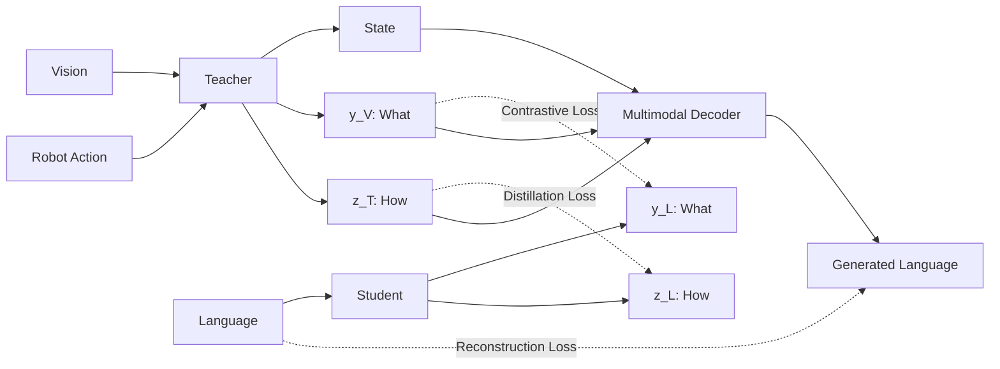

# AntVLA

## Overview

**AntVLA** is a vision-language-action representation learning framework
for robot manipulation.

The core idea is to decompose manipulation knowledge into three
complementary components:

- **What** — object and semantic representation
- **How** — action and manipulation representation
- **State** — physical and spatial state

AntVLA adopts a **Teacher-Student architecture** to bridge
world-side multimodal representations and language-side representations.

The Teacher learns structured representations from vision and robot
action data, while the Student learns to recover the corresponding
representations directly from language.

---

## Architecture

Here is the block diagram of the AntVLA framework architecture:

